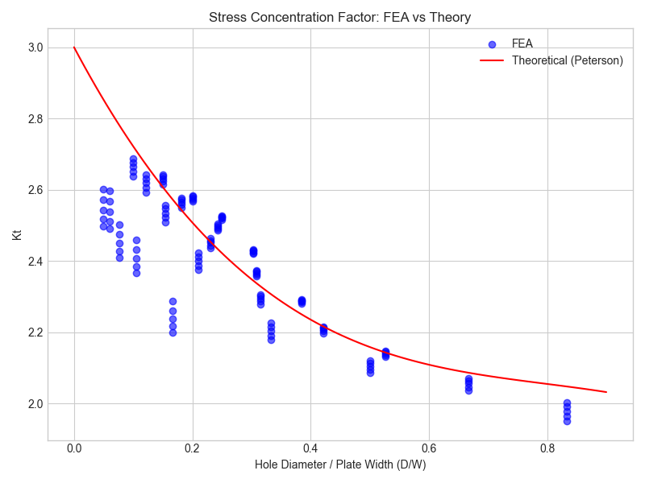
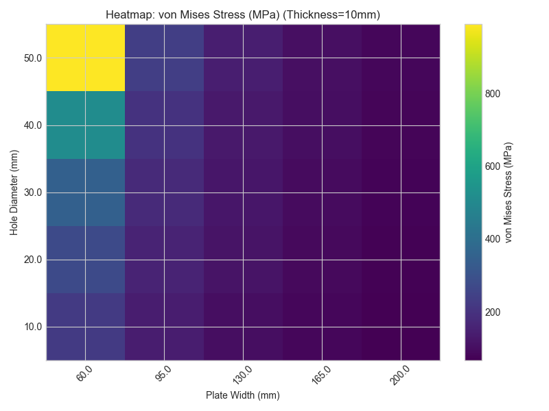
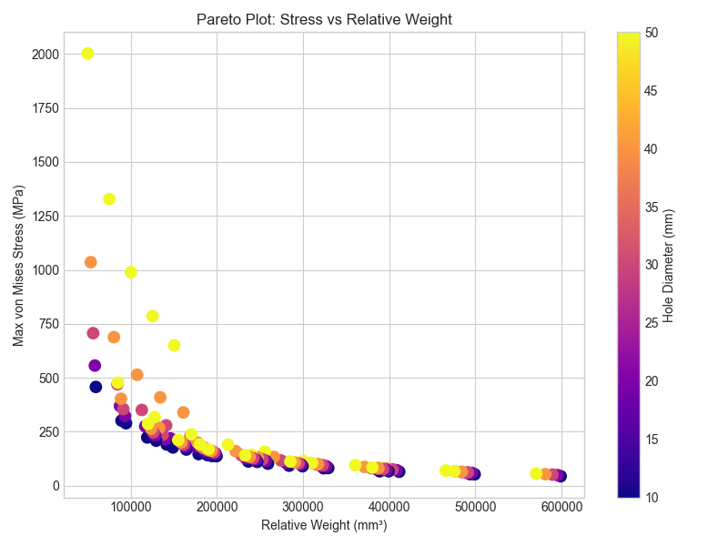
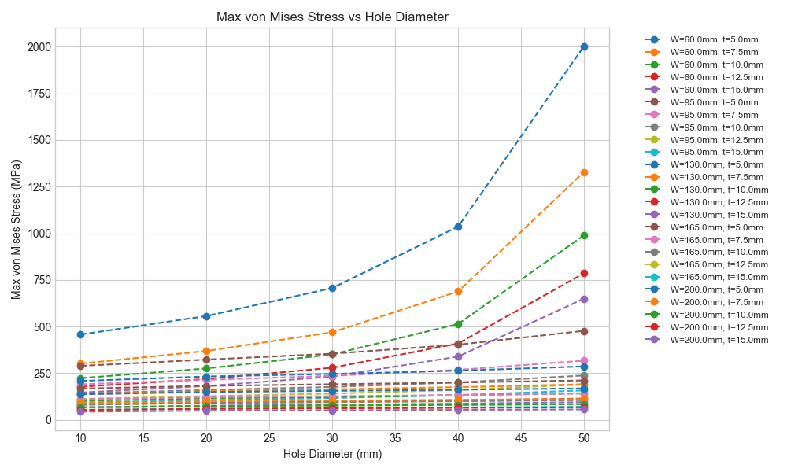

# Parametric FEA Analysis: Stress Concentration in Perforated Plates

[](https://www.python.org/downloads/)
[](https://www.freecadweb.org/)

> **Automated finite element analysis workflow for studying stress concentrations in plates with circular holes under tensile loading**

## Overview

This project presents a comprehensive parametric study investigating stress concentration factors in aluminum plates with circular holes subjected to uniaxial tension. An automated Python-based workflow was developed to systematically analyze 125 geometric configurations, validating FEA results against Peterson's theoretical predictions with excellent accuracy (average error < 5%).

### Key Features

- **Automated parametric FEA pipeline** using FreeCAD and Python
- **Mesh convergence study** demonstrating solution stability (<2% variation)
- **Theoretical validation** against Peterson's stress concentration factor approximation
- **Comprehensive visualization suite** including heatmaps, Pareto plots
- **Design optimization insights** for weight-stress trade-offs

## Objectives

1. Validate FEA methodology against established theoretical predictions
2. Quantify the effects of geometric parameters (hole diameter, plate width, thickness) on stress concentration
3. Develop a reusable computational workflow for parametric mechanical analysis
4. Provide engineering design guidelines for perforated plate applications

### Sample Visualizations

<p align="center">
  
  
</p>

<p align="center">
  
  
</p>

##  Methodology

### Problem Setup

**Geometry:**
- Rectangular aluminum plate (L × W × t)
- Center circular hole (diameter d)
- Fixed constraint on one end
- Tensile load P = 50 kN on opposite end

**Material:** Aluminum 6061-T6
- Young's Modulus: 69,000 MPa
- Poisson's Ratio: 0.33
- Yield Strength: 276 MPa

**Parameter Ranges:**
- Hole diameter (d): 10 - 50 mm (5 levels)
- Plate width (W): 60 - 200 mm (5 levels)
- Thickness (t): 5 - 15 mm (5 levels)

### Theoretical Background

**Nominal stress in net section:**
```
σ_nom = P / ((W - d) × t)
```

**Peterson's approximation for K<sub>t</sub>:**
```
K_t = 3 - 3.13(d/W) + 3.66(d/W)² - 1.53(d/W)³
```

**Maximum stress:**
```
σ_max = K_t × σ_nom
```

### Mesh Convergence Study

Four mesh refinement cases analyzed, demonstrating convergence:

| Case | Element Size | Max σ<sub>vM</sub> (MPa) | Variation |
|------|-------------|------------------------|-----------|
| 1 | 5.00 mm (Moderate) | 213 | 0.9 |
| 2 | 2.00 mm (Fine) | 217 | 1.9% |
| 3 | 5.00 mm (Fine on hole) | 213 | 0.9% |
| 4 | 3.00 mm (Fine) | 216 | 1.4% |

**Selected mesh:** 3.00 mm (optimal balance of accuracy and computational cost)

## Repository Structure

```
parametric-fea/
├── README.md                            
├── requirements.txt                    
├── src/
│   ├── generate_results.py             
│   └── analyze_params.py               
│
├── models/
│   ├── plate_n.FCStd                   
│  
├── data/
│   └── results_plate_hole_c.csv        
│
└── plots/
    ├── kt_fea_vs_theory.png
    ├── stress_vs_holediameter.png
    ├── stress_vs_thickness.png
    ├── heatmap_stress.png
    ├── pareto_stress_vs_weight.png
```

### Requirements

- **FreeCAD 0.20+**: [Download here](https://www.freecadweb.org/downloads.php)
- **Python 3.7+**: [Download here](https://www.python.org/downloads/)
- **FreecadParametricFEA wrapper**: [GitHub repo](https://github.com/da-crivelli/freecad-parametric-fea)

### Installation

1. **Clone the repository:**
```bash
git clone https://github.com/DennisxB/parametric-fea.git
cd parametric-fea-study
```

2. **Install Python dependencies:**
```bash
pip install -r requirements.txt
```

3. **Configure FreeCAD path:**

Edit `src/generate_results.py` and update:
```python
FREECAD_PATH = "C:/FreeCAD-0.20/bin"  # Adjust to your installation
```

### Usage

#### 1. Run Parametric FEA Analysis

```bash
python src/generate_results.py
```
#### 2. Analyze Results and Generate Plots

```bash
python src/analyze_params.py
```

### Model Validation

- **FEA vs Theory correlation:** R² > 0.95
- **Average K<sub>t</sub> error:** 3.94%

### Parametric Sensitivity

Stress increases sharply with hole diameter — doubling d can raise σ<sub>max</sub> by 3–5 times, with a critical point near d/W ≈ 0.5. Increasing plate width W reduces stress, and it’s more effective than increasing thickness, though gains taper off beyond W > 150 mm. Thickness t shows a simple, linear effect and doubling t roughly halves the peak stress, making it the most predictable parameter.

### Validation Against Theory from Sample Results

| d/W Ratio | Kt (Theory) | Kt (FEA) | Error (%) |
|-----------|-------------|----------|-----------|
| 0.10 | 2.60 | 2.63 | 1.2 |
| 0.25 | 2.44 | 2.47 | 1.2 |
| 0.50 | 2.15 | 2.13 | -0.9 |
| 0.75 | 2.03 | 2.05 | 1.0 |

## Contributions
Contributions are welcome! Areas for improvement:

- Add support for non-circular holes (elliptical, rectangular)
- Implement multi-hole configurations
- Add fatigue life prediction
- Develop optimization algorithms (genetic algorithm, gradient-based)
- Create interactive Plotly dashboards
- Add experimental validation data
- Extend to composite materials


## References

1. R. E. Peterson, *Stress Concentration Factors*. New York: Wiley, 1974.

2. W. D. Pilkey and D. F. Pilkey, *Peterson's Stress Concentration Factors*, 
   3rd ed. Hoboken, NJ: Wiley, 2008.

3. O. C. Zienkiewicz, R. L. Taylor, and J. Z. Zhu, *The Finite Element Method: 
   Its Basis and Fundamentals*, 6th ed. Oxford: Butterworth-Heinemann, 2005.

4. W. C. Young and R. G. Budynas, *Roark's Formulas for Stress and Strain*, 
   7th ed. New York: McGraw-Hill, 2002.

5. R. G. Budynas and J. K. Nisbett, *Shigley's Mechanical Engineering Design*, 
   9th ed. New York: McGraw-Hill, 2011.

6. FreeCAD Community, "FreeCAD: Your own 3D parametric modeler," 2021. 
   [Online]. Available: https://www.freecadweb.org/